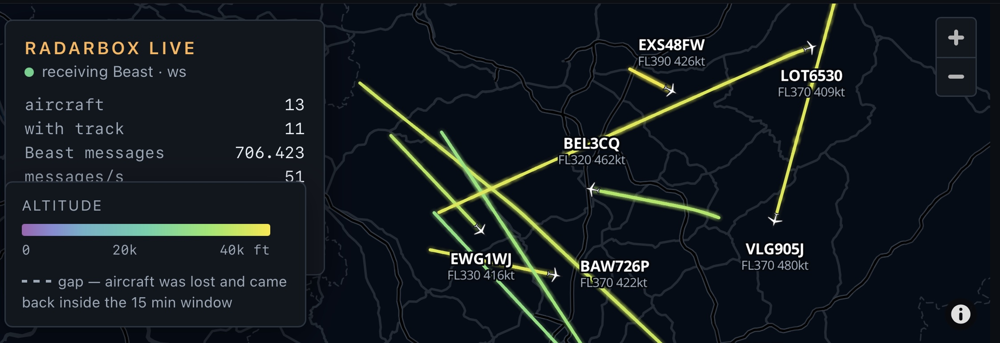

# ANRB3 driver

A userspace driver and Mode-S/ADS-B decoder for the AirNav RadarBox (USB ID
`0403:a2e0`), and a bridge that shows the decoded traffic on a live map. The
driver uses libusb. It needs no vendor software, no kernel module and no
`ftdi_sio` binding.

The RadarBox is an FTDI FT232R connected to a PIC microcontroller. The PIC
sends raw samples, eight per Mode-S bit. After a challenge-response handshake
it streams bursts of samples until it is told to stop. This project does the
demodulation, framing, error correction, CRC validation and ADS-B decoding in
software.

| directory | contents |
|---|---|
| `driver/` | USB access, decoder, tracker, network feeds |
| `bridge/` | HTTP and WebSocket server for the map, and the map page |
| `docker/` | Dockerfile for both programs |
| `deploy/` | deployment script, Compose file, nginx snippet, udev rule |

## Building

Requires Rust 1.87 or later. CI also builds with the latest stable release.

    cargo build --release

This builds three programs in `target/release/`:

- `anrb-rx`: the receiver
- `anrb-replay`: decodes a recorded USB stream offline
- `anrb-map`: the map bridge

The receiver needs the libusb 1.0 development headers. The decoder library
does not: `cargo build -p anrb --no-default-features` builds it without the
`usb` feature and without libusb. The `profile` and `profile_fine` features add
timers to the decode loop for profiling.

## Receiver

    anrb-rx --server

The receiver opens the USB device, unlocks it and serves the decoded traffic
on two TCP ports:

| port | format | option |
|---|---|---|
| 30005 | Mode-S Beast binary, every frame | `--beast PORT` |
| 30003 | BaseStation (SBS-1) text, decoded fields | `--sbs PORT` |

Feeder software can read Beast from port 30005.

With `--server`, the receiver runs until it is stopped and writes a status line
every 60 seconds (`--status-every`). Without `--server`, it shows a dashboard
on a terminal, or one line per frame with `--plain` or when the output is not a
terminal, and it stops after 120 seconds (`--seconds`). `--raw-log FILE` writes
the raw USB stream to a file, which `anrb-replay FILE` decodes later.
`anrb-rx --help` lists all options.

The Beast output has no timestamps and no signal levels. The device has no
12 MHz clock and reports neither. The timestamp field is zero, which means "no
timestamp". ADS-B feeding works, but multilateration (MLAT) does not: turn MLAT
off in feeder software that reads from this receiver.

The receiver needs read and write access to the USB device.
`deploy/99-anrb.rules` is a udev rule that gives the device to the group
`anrb`. Add your user to that group, or run the receiver as root.

## Map bridge

    anrb-map --root bridge/web

The bridge reads the receiver's Beast feed and serves the map page on port
8080.

| option | default | |
|---|---|---|
| `--host HOST` | `127.0.0.1` | receiver address |
| `--feed beast\|sbs` | `beast` | which receiver feed to read |
| `--beast-port PORT` | `30005` | |
| `--sbs-port PORT` | `30003` | |
| `--http-port PORT` | `8080` | |
| `--bind ADDR` | `0.0.0.0` | address to listen on |
| `--cert FILE`, `--key FILE` | | serve HTTPS (PEM files) |
| `--root DIR` | `web` | directory with `index.html` |
| `--cache DIR` | `~/.cache/anrb-map` | hexdb.io cache |
| `--no-hexdb` | | no lookups |
| `--logos DIR` | | airline logos |

The SBS feed carries fewer fields than Beast: the autopilot state, emitter
category and other Beast-only fields are missing.

The map shows:

- the tracks of the last 15 minutes, coloured by altitude; a dashed segment
  marks a gap of more than 60 seconds
- a symbol for each aircraft: narrowbody, regional, widebody or four-engined
  jet, business jet, turboprop, light aircraft, helicopter, fighter, glider,
  balloon, drone or ground vehicle
- a label with the callsign, an arrow when the aircraft climbs or descends
  faster than 300 ft/min, `AP` when the autopilot is engaged and `M` for a
  military address, and below it the flight level and ground speed
- a panel with all known fields when an aircraft is selected
- the viewer's position; browsers share it only over HTTPS or from localhost

### Lookups

The bridge gets registration, aircraft type, operator, route, airport names
and photos from [hexdb.io](https://hexdb.io/). The bridge makes the requests,
not the browser. It caches the answers for ten days, including "not found"
answers.

The page requests the registration of every aircraft on the map, at most four
at a time, because the aircraft type selects the symbol. Without a known type,
the emitter category transmitted by the aircraft selects the symbol.

With `--no-hexdb`, the bridge makes no outbound requests and does not use the
cache. The `/api/` and `/photo/` endpoints return 404, and the page does not
request them.

`--logos DIR` serves airline logos from a directory of `<ICAO code>.bmp` files.

`bridge/web/countries.js` maps an ICAO address to its country of registration
and marks military address blocks. It is generated from the range table in
[tar1090](https://github.com/wiedehopf/tar1090) `flags.js`, which follows ICAO
Annex 10, Volume III.

## Deployment

    deploy/ship.sh pi@raspberrypi

`ship.sh` builds both images on the local machine for the target's
architecture (arm64, 32-bit ARM or amd64), copies them to the target over SSH
and starts them with `deploy/compose.yml`. The local machine needs Docker with
buildx. The target needs Docker with the Compose plugin. The target does not
build anything.

Both containers run as uid 10001. The receiver container accesses the USB
device through the `anrb` group. Before the first deployment, create the group
and install the udev rule on the target. `ship.sh` copies the rule to
`~/anrb/99-anrb.rules`:

    sudo groupadd --system anrb
    sudo cp ~/anrb/99-anrb.rules /etc/udev/rules.d/
    sudo udevadm control --reload && sudo udevadm trigger

`ship.sh` passes the group ID to Compose. If the group does not exist, it stops
before building.

Compose publishes the bridge on `127.0.0.1:8088` only. `deploy/nginx.conf` is a
snippet for an existing nginx `server` block that serves the map at `/radar/`,
including the WebSocket. The page uses relative URLs, so changing the prefix in
the snippet is enough.

## Docker

The Dockerfile requires BuildKit. On Linux, install the buildx plugin
(`docker-buildx` on Debian and Ubuntu). It has two targets, `driver` and
`bridge`. Without `--target`, Docker builds the bridge.

    docker buildx build -f docker/Dockerfile --target driver -t anrb --load .
    docker run -d --name anrb --restart unless-stopped \
        -v /dev/bus/usb:/dev/bus/usb --device-cgroup-rule='c 189:* rmw' \
        --group-add "$(getent group anrb | cut -d: -f3)" \
        -v /etc/localtime:/etc/localtime:ro \
        -p 30003:30003 -p 30005:30005 anrb

The container gets the whole USB bus, not a single device node. The driver
power-cycles the device when it stops responding, and the device then gets a
new device number, which a `--device` binding does not follow. The container
runs as uid 10001; `--group-add` gives it the `anrb` group, which owns the
device. The `/etc/localtime` mount sets the container's time zone. Without it,
BaseStation timestamps and log lines are in UTC.

    docker buildx build -f docker/Dockerfile --target bridge -t anrb-map --load .

The bridge image reads from `anrb:30005`. Use `--host` to change the receiver
address.

## Decoding

The device sends samples, not frames. The decoder does in software what a
Beast receiver does in hardware:

- A three-stage demodulator. It computes group sums as popcounts of packed
  samples, and evaluates the threshold recurrence as a parallel prefix scan.
- A search over 36 framing configurations per burst. A single-entry cache skips
  repeated work when the sample offset has not changed.
- CRC-24 validation, one-bit correction from a syndrome table, and two-bit
  correction guided by demodulator confidence. `--2bit` adds unguided two-bit
  correction for DF11 and DF17.
- SSSE3 (x86_64) and NEON (aarch64) code with a portable fallback. The tests
  check each against the portable code.

Formats with the address overlaid on the parity (DF0, 4, 5, 16, 20 and 21)
cannot be validated on their own. The receiver does not decode them;
`anrb-replay --overlaid` does. It accepts them only for addresses seen at least
twice in CRC-validated messages. Two such addresses that differ in a single
bit are both refused, because one bit error turns one into the other.

A position is published only when two fixes from different messages agree, or
when a fix agrees with a recent published position. A CPR pair from a repaired
frame can be off by a whole zone, and one corrupt message must not move an
aircraft.

## Tests

    cargo test --release

The tests do not need the hardware. The decoder tests use synthetic bursts
built from real frames. The USB tests use a scripted device. The tests cover
the CRC and error correction, CPR, the tracker, the feeds, the dashboard, both
programs, and the bridge's HTTP and WebSocket handling, hexdb cache and feed
readers.

Three tests read capture files from `captures/`, which is not in the
repository: two read `bursts.bin` and one reads `tuning_15min_v2.raw`. Without
the files they pass without checking anything.

`ANRB_BACKEND=scalar` forces the portable decoder code, so the portable and
SIMD code can both be tested on one machine.

    npm test

tests `bridge/web/tracks.js`, the page's drawing logic: track gaps, colours and
expiry, the label text, and the symbol choice for every listed aircraft type.

CI (`.github/workflows/ci.yml`) first checks formatting with rustfmt and
Prettier. Then it runs, with warnings as errors:

- clippy on the workspace, on the decoder without default features, with the
  `profile_fine` feature, and for aarch64
- rustdoc, with and without private items
- the tests on the latest stable release, also for the decoder without default
  features and with `ANRB_BACKEND=scalar`
- the tests on Rust 1.87
- the page tests (`npm test`)
- a coverage check that fails below 90% line coverage

The same checks locally:

    cargo fmt --all --check
    npm ci && npm run format:check
    cargo clippy --workspace --all-targets -- -D warnings
    RUSTDOCFLAGS="-D warnings" cargo doc --workspace --no-deps
    cargo test --workspace
    npm test
    cargo llvm-cov --workspace --fail-under-lines 90
